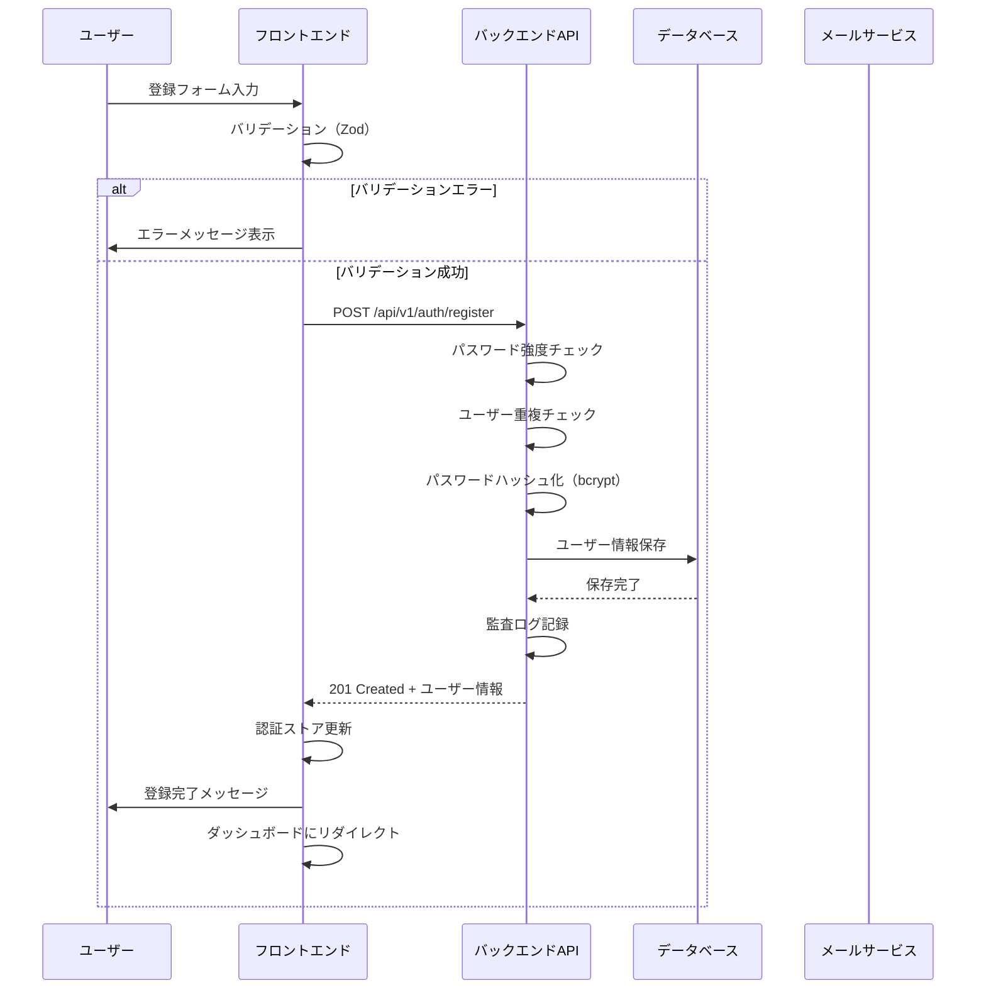
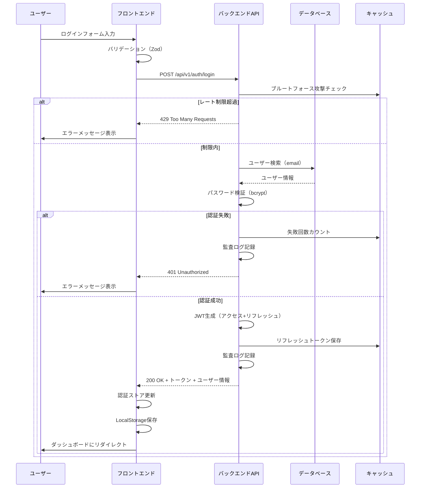
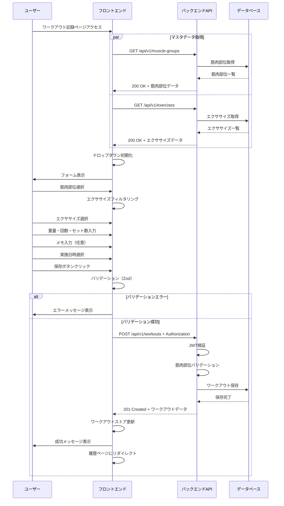
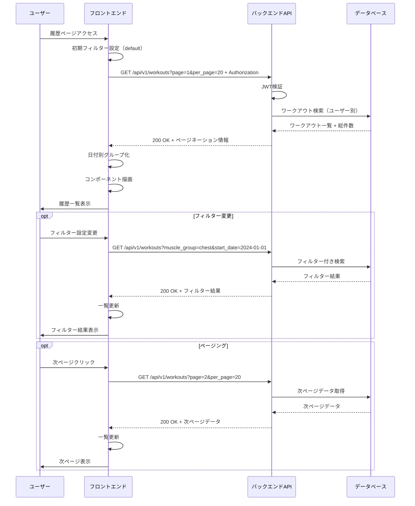
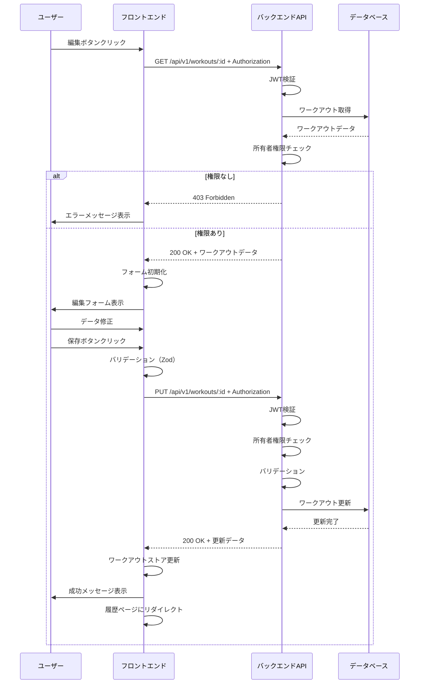
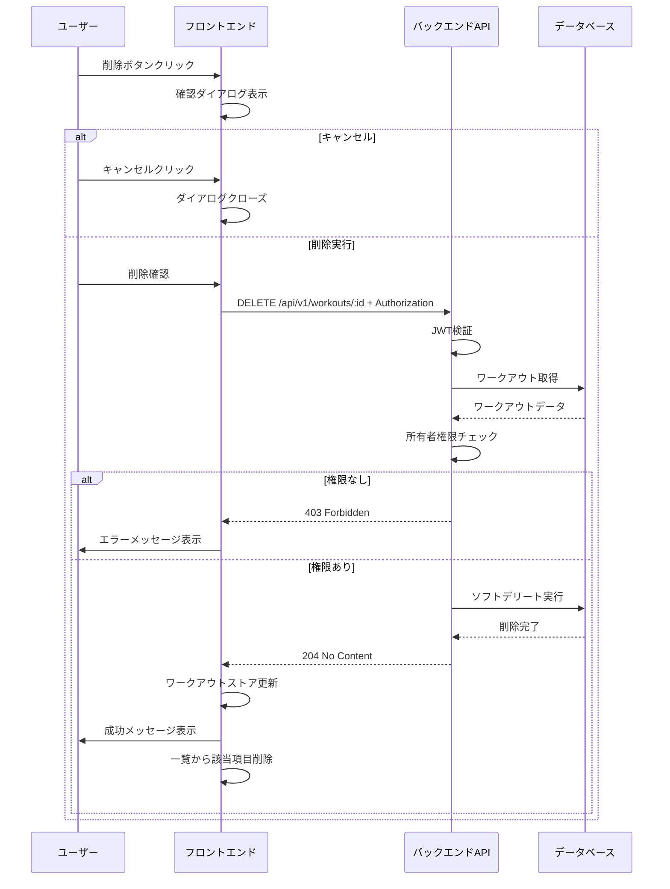
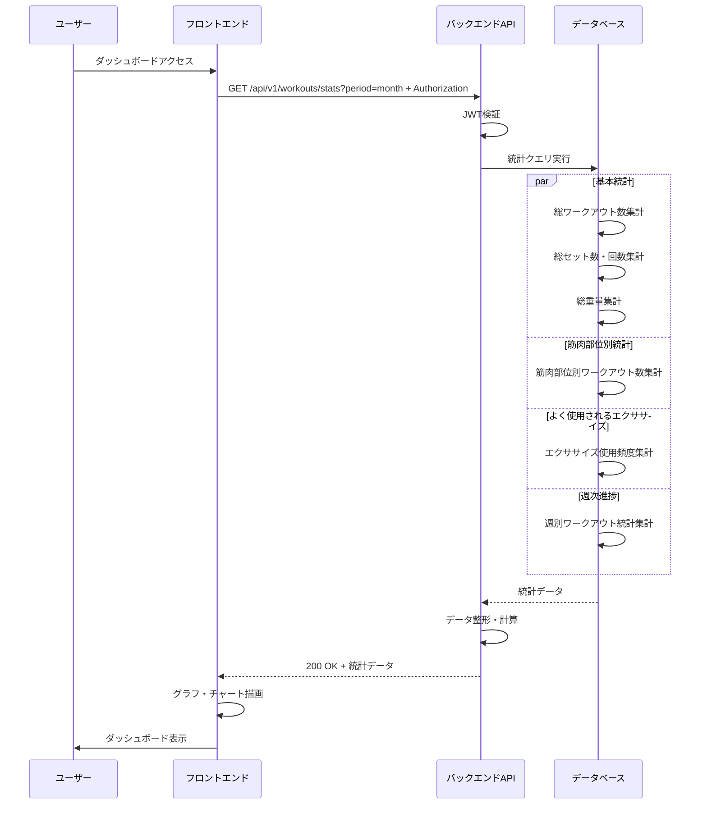
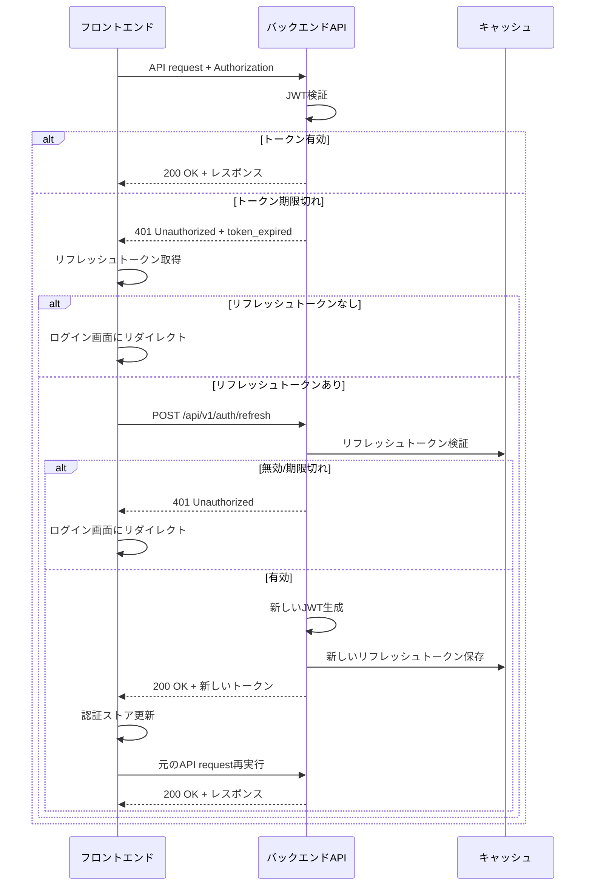
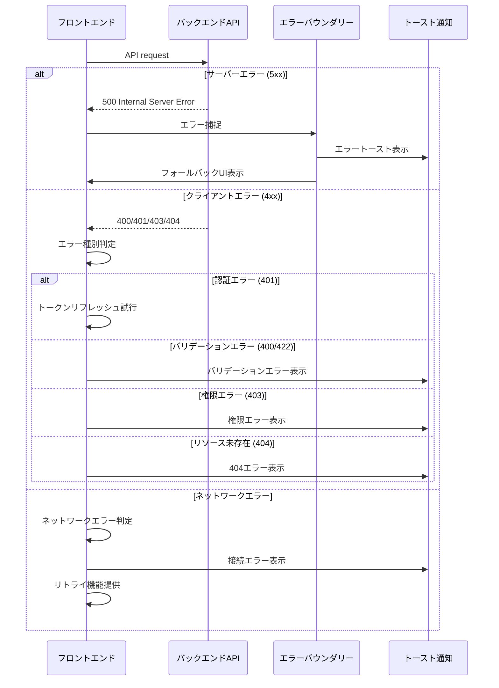

# シーケンス図

## 概要
VisualTrecplansアプリケーションの主要な機能フローをシーケンス図で表現します。

## 1. ユーザー登録フロー

## 2. ログインフロー

## 3. ワークアウト記録フロー

## 4. ワークアウト履歴表示フロー

## 5. ワークアウト編集フロー

## 6. ワークアウト削除フロー

## 7. 統計データ取得フロー

## 8. トークンリフレッシュフロー

## 9. エラーハンドリングフロー

